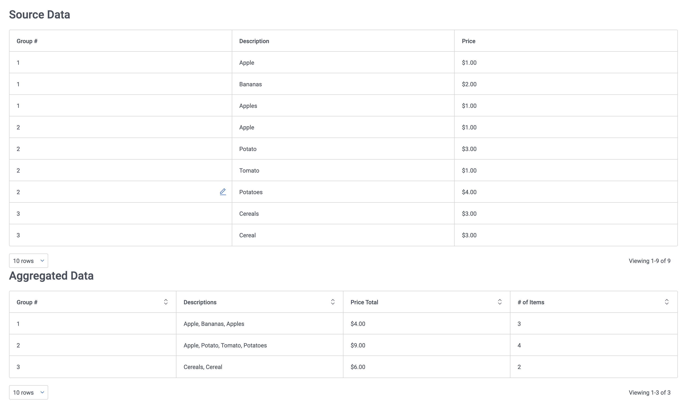

# Client-side aggregate models

Have you ever wanted to group and aggregate data from one or more models that didn't support server-side aggregation?

Here's a Skuid Page that shows how you can do that.

The fundamental approach is this:

 1. Create a Ui-Only Model to use as the "client-side Aggregate Model"
 1. Create a JavaScript Snippet which iterates over all rows in a source Model (of any Data Source), and groups the rows by a grouping field, and then aggregates other fields or concatenates their values as desired into fields on the Ui-Only Model.
 1. Add a Model Action on the source Model which runs this data grouping/aggregation snippet whenever that Model is queried/saved/cancelled -- whatever events you desire. If you re-run the snippet on change, you get live-updates to your aggregate model --- super cool!

 ## What it looks like

## How to use this

1. Download the [XML](clientSideAggregation.xml) for this page.
1. From the Skuid Pages list, click "Create new page", and select "Upload XML". Select the file you downloaded. The API Version for the page should automatically be detected as V2.
1. Save and Preview