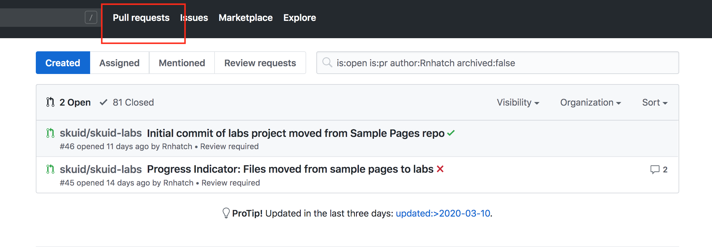

# Contributing to Github using only Github

This is a step by step tutorial for contributing content to Skuid Labs (or other documentation repos) using just the Github website. 

Typically,  developers who contribute to a central source code repository like Github have a series of tools required to do local development. When code is completed and tested locally,  they push changes to the remote repository.  The local copy is a convenience,  and is required if you need to ensure some piece of code works before committing it to the repository.  However in the case of documentation and other forms of content, there is no "local testing". This makes the local developement infrastructure (code editors,  terminal commands,  git clients etc) a unecessary obstacle to participation. One may work entirely in the github website (the remote repository). This document shows how one does this work. 

There will come a time when local development infrastructure is needed or convenient,  but it can not be an obstacle to content contribution.  

# Instructions

**Step 1.  Go to the SkuidLabs repo.** 

Remember:  https://github.com/skuid/skuid-labs

**Step 2.  Create a new branch.**
- Open the branch selector button and type name of a new branch (or select the branch you were already working on). 
- Don't try to edit documents in Master.  

**Step 3. Navigate to the directory where you want to create your new document.**

**Step 4. Click `Create New File` button.**

**Step 5. Start typing name of new directory and readme file.**

- When you type a `/` Github will interpret this as a new directory and expose a new text box.
  - Backspace to get back and edit the directory name
- The first file you create should be  `README.md` 
- Be careful.  Once you've created a file, it is difficult to change the directory name. 

**Step 6. Write your document using Markdown syntax.**

- [Here is a helpful document](https://help.github.com/en/github/writing-on-github/basic-writing-and-formatting-syntax) for styling your document using Markdown
- Preview your changes as you work. 

**Step 7. Commit your changes early and often.**

- Scroll to the bottom of your document 
- Write a commit message
- Select the `commit directly to the <<branch name>> branch` option

**Step 8.  After committing - you will have to click edit to keep working.**

- Look for the edit pencil in the title bar for your file. 

# Adding images and other files

Commit your Readme file and navigate to the directory your created. You want to make sure images and other files related to your experiment are in the same directory as your ReadMe file. 

**Step 9. Click the `Add Files` button and drag files into the big box**

- After uploading you need to commit these files to your repo.  
- Make sure your commit message is suitably snarky. 

**Step 10.  Edit your readme file to include relative links to the images you just uploaded.**  

- Like this:  `</img>`
- Upload page xml in the same way 
  - Or create a new file as shown above, with an `.xml` file extension.  
  - Then copy your page xml into that new file. 
- Upload design system zip files in the same way. 

**Step 11.  Rinse and repeat until you have it just perfect.**

- Commit your work and look it over one last time.
- Makes sure it looks perfect in your branch. 

# Open a Pull Request for review and approval. 

Github provides really good tools for collaborative review and editing.  The `Pull Request` mechanism gets this started. This is a request to the maintainers of this repo to "pull" your code into the master branch. 

**Step 12. Create a Pull Request**

- Navigate to the directory where all your work is contained. 
- Click `Pull Request` in header bar of the directory. 

**Step 13.  Fill out Pull Request**

- Make sure you are merging `Your Branch` to `Master`. 
  - Github allows for super complex branching, but there is no need to get into all that here. 
- Document what you are trying to do in the title and description.  
  - Don't simply copy your document in this description...
- Click the :gear: next to `Reviewers` to request editorial approval. 
  - One of these reviewers will need to approve your work before merging to master and making available to the world. 
- Click `Create Pull Request`
  - Email notifications will be sent to the reviewers you have requested
  - You can send them a reminder on the back of a $20.00 bill.  

**Step 14.  Handle the back and forth.** 

Now the Pull Request is in play and you'll go back and forth with the editors in a pull request conversation. 
- Use the "Pull Requests" link at the top of Github to see the ones you have outstanding. 

The reviewer will comment generally, or will highlight specific areas of your code that needs to be improved. 
- You will get an email when they have commented.  
  - You can also just check your Pull Request.  
  - Icons in the list will indicate when there have been comments or approvals. 
- Adjust your code as requested by your reviewer. 
  - You can sometimes accept reccomendations directly in the pull request conversation and commit changes there. 
  - Other times you need to edit your code in the directory and commit it again. 
- All this change history shows up in the `Commits` tab. 

**Step 15. Glorious Approval!!** 

When your reviewer has approved your new article you will get an email, or you will see the status change in the PR list. 
- Your Job is not Done! 
- At the bottom of the Pull Request screeen look for the "Squash and Merge" button.
  - Add a final commit message with a basic description of the project
  - Confirm the merge
- After merging make sure you delete your original branch 

Celebrate your contribution to our code repository.  :tada: :tada:
